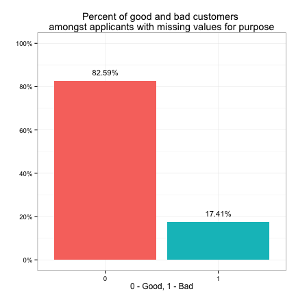
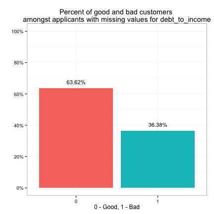
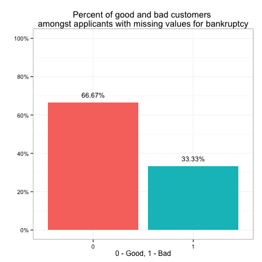

# 01-missing-value-treatment

Install and load the following packages.

A> {linenos=off}
```r
install.packages("devtools")
devtools::install_github("gmlang/ezplot")
devtools::install_github("gmlang/loans")
library(ezplot)
library(loans)
```

Create a directory called *score-loan-applicants* under your home directory. Use it as the project folder that will store all files related with our analysis, which include code, processed data, intermediate results, figures, and etc.

A> {linenos=off}
```r
proj_path = "~/score-loan-applicants"
dir.create(proj_path, showWarnings=FALSE)
```

Examine the unsecured personal loans (upl) data.

A> {linenos=off}
```r
str(upl, vec.len=3)
\n
'data.frame':	7250 obs. of  17 variables:
 $ purpose            : num  0 0 0 1 NA 0 1 0 ...
 $ age                : num  38.3 40.3 21.7 37.5 ...
 $ marital            : num  0 1 0 1 0 0 0 1 ...
 $ employment         : num  1 1 1 3 2 1 5 1 ...
 $ annual_income      : num  225523 93072 66236 45626 ...
 $ debt_to_income     : num  0.393 0.357 0.868 1.574 ...
 $ market_value       : num  1540881 1159186 0 1069064 ...
 $ own_property       : num  1 1 0 1 1 0 0 1 ...
 $ late_repayments    : num  0 0 0 1 1 0 1 0 ...
 $ repossess          : num  0 0 0 0 0 0 0 1 ...
 $ conviction         : num  0 0 0 0 0 0 0 0 ...
 $ bankruptcy         : num  0 0 0 0 0 0 0 0 ...
 $ unspent_convictions: num  1 0 0 0 0 0 0 0 ...
 $ credit_applications: num  2 2 3 7 3 4 4 2 ...
 $ credit_line_age    : num  77.5 72.8 15.7 6.9 ...
 $ exist_customer     : num  0 0 0 0 0 1 0 0 ...
 $ bad                : num  0 0 0 1 1 1 0 0 ...
 - attr(*, "codepage")= int 65001
```

We see the data contains 7250 observations and 17 variables. You can find out the definitions of the variables by typing `?upl`.

All variables are coded as numeric. We know the response variable is in fact a binary indicator. We thus change it to factor.

A> {linenos=off}
```r
upl$bad = as.factor(upl$bad)
```

We also need to change the following predictors to factors. But first, we change them to characters and check missing values.

A> {linenos=off}
```r
iv_cat = c("bankruptcy", "purpose", "exist_customer", "unspent_convictions", 
           "conviction", "repossess", "own_property", "late_repayments", 
           "marital", "employment")
for (var in iv_cat) upl[[var]] = as.character(upl[[var]])
```

A> {linenos=off}
```
str(upl[, iv_cat], vec.len=3) 
\n
'data.frame':	7250 obs. of  10 variables:
 $ bankruptcy         : chr  "0" "0" "0" ...
 $ purpose            : chr  "0" "0" "0" ...
 $ exist_customer     : chr  "0" "0" "0" ...
 $ unspent_convictions: chr  "1" "0" "0" ...
 $ conviction         : chr  "0" "0" "0" ...
 $ repossess          : chr  "0" "0" "0" ...
 $ own_property       : chr  "1" "1" "0" ...
 $ late_repayments    : chr  "0" "0" "0" ...
 $ marital            : chr  "0" "1" "0" ...
 $ employment         : chr  "1" "1" "1" ...
```

Check which variables have missing values.

A> {linenos=off}
```r
n = nrow(upl) # count total number of observations
vars = names(upl)
varsNA = pctNA = c()
for (var in vars) {
        cntNA = sum(is.na(upl[[var]]))
        if (cntNA > 0) {
                varsNA = c(varsNA, var)
                pctNA = c(pctNA, cntNA/n)
        }
}
pctNA = paste0(round(pctNA*100, 2), "%")
pct_missing = data.frame(vars=varsNA, percent_missing = pctNA)
print(pct_missing)
```

A> {linenos=off}
```
            vars percent_missing
1        purpose          15.13%
2 debt_to_income           6.03%
3   market_value           9.17%
4     bankruptcy           3.97%
```

Distribution of the target variable

The data set contains 7250 observations, of which 82% are good customers while 18% are bad ones as shown below. The imbalanced distribution of the target variable implies that we can't merely use the overall classification accuracy to measure model performance. For example, suppose we build a model, and it gives us an accuracy of 82%. We wouldn't consider it to be a good model here because we can achieve the same 82% accuracy by simply predicting every observation as good without fitting any model. We want to build models that can correctly identify the bad customers. Therefore, we need to use more granular measures such as sensitivity and specificity to assess model performances. 

A> {linenos=off}
```r
## BEGIN Define Function

pct_good_n_bad = function(dat, yvar, xvar = ""){
        if (xvar == "") tbl = data.frame(table(dat[[yvar]]))
        else tbl = data.frame(table(dat[[yvar]][is.na(dat[[xvar]])]))
        tbl$percent = tbl$Freq / sum(tbl$Freq)
        tbl$Freq = NULL
        names(tbl) = c(yvar, "percent") 
        tbl
}

## END Define Function

# calculate the distribution of each level in target and plot it
tbl = pct_good_n_bad(upl, "bad")
plt = mk_barplot(tbl)
p = plt("bad", "percent", fillby="bad", xlab="0 - Good, 1 - Bad", legend=F,
        main = "Proportion of Good and Bad Customers")
p = scale_axis(p, "y", use_pct=T, pct_jump=0.2)
print(p)
```

 

Explore the relationship between missing values and the target

Bankruptcy has few missings (< 4%), Purpose has heavy missings (> 15%), Debt_to_Income has few missings (~ 6%), and Market_Value has 9% missings

A> {linenos=off}
```r
# # Bankruptcy has few missings (< 4%)
# tbl = pct_good_n_bad(dat, "bad", "bankruptcy")
# plt = mk_barplot(tbl)
# p = plt("bad", "percent", fillby="bad", xlab="0 - Good, 1 - Bad", legend=F,
#         main = "Proportion of good and bad customers amongst customers with
#                 missing values for bankruptcy")
# p = scale_axis(p, "y", use_pct=T, pct_jump=0.2)
# print(p)
# 
# # Purpose has heavy missings (> 15%)
# tbl = pct_good_n_bad(dat, "bad", "purpose")
# plt = mk_barplot(tbl)
# p = plt("bad", "percent", fillby="bad", xlab="0 - Good, 1 - Bad", legend=F,
#         main = "Proportion of good and bad customers amongst customers with
#                 missing values for purpose")
# p = scale_axis(p, "y", use_pct=T, pct_jump=0.2) 
# print(p)
# 
# # Debt_to_Income has few missings (~ 6%)
# tbl = pct_good_n_bad(dat, "bad", "debt_to_income")
# plt = mk_barplot(tbl)
# p = plt("bad", "percent", fillby="bad", xlab="0 - Good, 1 - Bad", legend=F,
#         main = "Proportion of good and bad customers amongst customers
#                 with missing values for debt_to_income")
# p = scale_axis(p, "y", use_pct=T, pct_jump=0.2)
# print(p)
# 
# # Market_Value has 9% missings
# tbl = pct_good_n_bad(dat, "bad", "market_value")
# plt = mk_barplot(tbl)
# p = plt("bad", "percent", fillby="bad", xlab="0 - Good, 1 - Bad", legend=F,
#         main = "Proportion of good and bad customers amongst customers with
#                 missing values for market_value")
# p = scale_axis(p, "y", use_pct=T, pct_jump=0.2)
# print(p)

# write a for loop to do the same thing. DRY
for (var in varsNA) {
        tbl = pct_good_n_bad(upl, "bad", var)
        title = paste("Percent of good and bad customers \namongst applicants with missing \nvalues for", var)
        plt = mk_barplot(tbl)
        p = plt("bad", "percent", fillby="bad", xlab="0 - Good, 1 - Bad", 
                main = title, legend=F)
        p = scale_axis(p, "y", use_pct=T, pct_jump=0.2)
        print(p)
        cat('\r\n\r\n')
}
```

 

 

 

 


Deal with missing values.

For categorical vars, change missing values to "unkown".

For continuous vars except market_value, fill the missing values with the grand median. 

For market_value, because it measures similar info with own_property, we fill the missings in market_value based on the values of own_property first. In particular, for records with own_property = 0 and missing market_value, we fill the missings with zeros. For records with own_property = 1 and missing market_value, we fill the missings with the grand median.

A> {linenos=off}
```r
> print(varsNA)
```

A> {linenos=off}
```
[1] "purpose"        "debt_to_income" "market_value"   "bankruptcy"    
```

A> {linenos=off}
```r
# if own_property = 0, market_value should also be 0
upl$market_value[upl$own_property == 0 & is.na(upl$market_value)] = 0

# # method 1
# upl = within(upl, {
#         bankruptcy[is.na(bankruptcy)] = "unknown"
#         purpose[is.na(purpose)] = "unknown"
#         debt_to_income[is.na(debt_to_income)] = median(debt_to_income, na.rm=T)
#         market_value[is.na(market_value)] = median(market_value, na.rm=T)
# })

# method 2
for (var in varsNA) {
        if (class(upl[[var]]) == "character") {
                print(var)
                upl[[var]][is.na(upl[[var]])] = "unknown"
                print(table(upl[[var]]))
        } else {
                print(var)
                upl[[var]][is.na(upl[[var]])] = median(upl[[var]], na.rm=T)                
                print(summary(upl[[var]]))
        }
}
```

A> {linenos=off}
```
[1] "purpose"

      0       1 unknown 
   4290    1863    1097 
[1] "debt_to_income"
   Min. 1st Qu.  Median    Mean 3rd Qu.    Max. 
 0.0505  0.3000  0.4400  0.5620  0.6500 17.2000 
[1] "market_value"
   Min. 1st Qu.  Median    Mean 3rd Qu.    Max. 
      0       0  856000  730000 1290000 2680000 
[1] "bankruptcy"

      0       1 unknown 
   6924      38     288 
```

Change the character predictors to factors

A> {linenos=off}
```r
for (var in iv_cat) upl[[var]] = as.factor(upl[[var]])
```

Create a *data* subfolder under proj_path to save the processed data for future use. 

A> {linenos=off}
```r
data_path = file.path(proj_path, "data")
dir.create(data_path, showWarnings=F)
save(upl, iv_cat, file=file.path(data_path, "cleaned-01.rda"))
```

