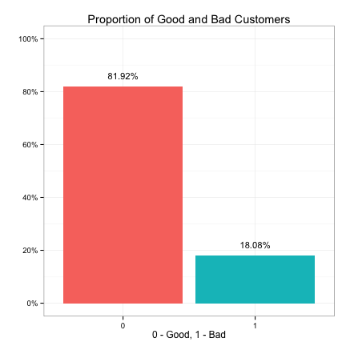
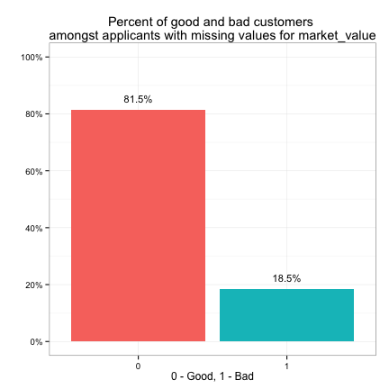

## Clean Data

Create a directory called *score-loan-applicants* under your home directory. Use it as the project folder that will store all files related with our analysis, which include code, processed data, intermediate results, figures, and etc.

A>
```r
proj_path = "~/score-loan-applicants"
dir.create(proj_path, showWarnings=FALSE)
```

Load the `ezplot` and `loans` libraries. The former allows us to make nice looking ggplot2 plots easily. The latter contains the unsecured personal loans (upl) dataset that we'll analyze.

A>
```r
library(ezplot)
library(loans)
```

Examine the dataset. We see it contains 7250 observations and 17 variables.

A>
```r
str(upl, vec.len=3)
```

A> {linenos=off}
```
'data.frame':	7250 obs. of  17 variables:
 $ purpose            : num  0 0 0 1 NA 0 1 0 ...
 $ age                : num  38.3 40.3 21.7 37.5 ...
 $ marital            : num  0 1 0 1 0 0 0 1 ...
 $ employment         : num  1 1 1 3 2 1 5 1 ...
 $ annual_income      : num  225523 93072 66236 45626 ...
 $ debt_to_income     : num  0.393 0.357 0.868 1.574 ...
 $ market_value       : num  1540881 1159186 0 1069064 ...
 $ own_property       : num  1 1 0 1 1 0 0 1 ...
 $ late_repayments    : num  0 0 0 1 1 0 1 0 ...
 $ repossess          : num  0 0 0 0 0 0 0 1 ...
 $ conviction         : num  0 0 0 0 0 0 0 0 ...
 $ bankruptcy         : num  0 0 0 0 0 0 0 0 ...
 $ unspent_convictions: num  1 0 0 0 0 0 0 0 ...
 $ credit_applications: num  2 2 3 7 3 4 4 2 ...
 $ credit_line_age    : num  77.5 72.8 15.7 6.9 ...
 $ exist_customer     : num  0 0 0 0 0 1 0 0 ...
 $ bad                : num  0 0 0 1 1 1 0 0 ...
 - attr(*, "codepage")= int 65001
```

All variables are coded as numeric. Some shouldn't be. For example, we know the target variable is in fact binary. So we change it to factor.

A>
```r
upl$bad = as.factor(upl$bad)
```

We can then look at the distribution of the target variable. First of all, we define a function that can be used to calculate the percent of good and bad customers.

A>
```r
pct_good_n_bad = function(dat, yvar, xvar = ""){
        # dat: a data frame
        # yvar, xvar: string, names of variables on dat
        if (xvar == "") tbl = data.frame(table(dat[[yvar]]))
        else tbl = data.frame(table(dat[[yvar]][is.na(dat[[xvar]])]))
        tbl$percent = tbl$Freq / sum(tbl$Freq)
        tbl$Freq = NULL
        names(tbl) = c(yvar, "percent") 
        tbl
}
```

Next, we use it to calculate the percent of good and bad customers in the upl dataset, and we show the result in a bar chart.

A>
```r
tbl = pct_good_n_bad(upl, "bad")
# append a column of label positions to tbl
f = add_bar_label_pos(tbl)
tbl = f("bad", "percent", vpos=0.04)
# draw bar plot
plt = mk_barplot(tbl)
p = plt("bad", "percent", fillby="bad", xlab="0 - Good, 1 - Bad", legend=F,
        main = "Proportion of Good and Bad Customers", barlab="percent",
        barlab_at_top=T, barlab_use_pct=T, barlab_size=4)
p = scale_axis(p, "y", use_pct=T, pct_jump=0.2)
print(p)
```

 

We see that ~82% of the customers in the upl dataset are good while ~18% are bad. This imbalanced distribution of the target variable implies that we can't merely use the overall classification accuracy to measure model performance. For example, suppose we build a model, and it gives us an accuracy of 82%. We wouldn't consider it good here because we can achieve the same 82% accuracy without fitting any model. Just simply guess every customer is good. Because we want to build models that can correctly identify the bad customers, we really need to use more granular measures such as sensitivity and specificity to measure model performance. 

Having looked at the target variable, now let's turn our attention to the predictors. We need to change the binary predictors to factors. But first, we change them to characters.

A>
```r
iv_cat = c("bankruptcy", "purpose", "exist_customer", "unspent_convictions", 
           "conviction", "repossess", "own_property", "late_repayments", 
           "marital", "employment")
for (var in iv_cat) upl[[var]] = as.character(upl[[var]])
str(upl[, iv_cat], vec.len=3)
```

A> {linenos=off}
```
'data.frame':	7250 obs. of  10 variables:
 $ bankruptcy         : chr  "0" "0" "0" ...
 $ purpose            : chr  "0" "0" "0" ...
 $ exist_customer     : chr  "0" "0" "0" ...
 $ unspent_convictions: chr  "1" "0" "0" ...
 $ conviction         : chr  "0" "0" "0" ...
 $ repossess          : chr  "0" "0" "0" ...
 $ own_property       : chr  "1" "1" "0" ...
 $ late_repayments    : chr  "0" "0" "0" ...
 $ marital            : chr  "0" "1" "0" ...
 $ employment         : chr  "1" "1" "1" ...
```

Next, we check which predictors have missing values.

A>
```r
n = nrow(upl)
vars = names(upl)
varsNA = pctNA = c()
for (var in vars) {
        cntNA = sum(is.na(upl[[var]]))
        if (cntNA > 0) {
                varsNA = c(varsNA, var)
                pctNA = c(pctNA, cntNA/n)
        }
}
pctNA = paste0(round(pctNA*100, 2), "%")
pct_missing = data.frame(vars = varsNA, percent_missing = pctNA)
print(pct_missing)
```

A> {linenos=off}
```
            vars percent_missing
1        purpose          15.13%
2 debt_to_income           6.03%
3   market_value           9.17%
4     bankruptcy           3.97%
```

We see **purpose** has more than 15% of its values missing, and **market_value**, **debt_to_income** and **bankruptcy** all have mild missings. Let's explore the relationship between the target variable and the missing values.

A>
```r
for (var in varsNA) {
        # calculate the percent of good and bad customers amongst customers with missing values in var
        tbl = pct_good_n_bad(upl, "bad", var)
        # append a column of label positions to tbl
        f = add_bar_label_pos(tbl)
        tbl = f("bad", "percent", vpos=0.04)
        # draw bar plot
        title = paste("Percent of good and bad customers \namongst applicants with missing values for", var)
        plt = mk_barplot(tbl)
        p = plt("bad", "percent", fillby="bad", xlab="0 - Good, 1 - Bad", 
                main = title, legend=F, barlab="percent", barlab_at_top=T,
                barlab_use_pct=T, barlab_size=4)
        p = scale_axis(p, "y", use_pct=T, pct_jump=0.2)
        print(p)
        cat('\r\n\r\n')
}
```

 

 

 

 


We see the target variable has the same distribution (82% good - 18% bad) amongst customers with missing purpose as amongst all customers. This is also true for market_value. This implies that we may choose to ignore the missing values when looking at the individual effect of purpose or market_value on the target variable. However, the target has a distribution of 67% good vs. 33% bad amongst customers with missing bankruptcy info, which is different from its overall distribution. The same is true for debt_to_income. This implies that we may not ignore the effect of missing values in bankruptcy or debt_to_income on the target.

Let's perform the following missing value treatments. For purpose and bankruptcy, because they are categorical, we change their missing values to "unkown". For debt_to_income, because it's continuous, we fill its missing values with the median of its non-missing values. For market_value, because it is related with own_property, we first fill its missing values based on the values of own_property. In particular, for customers with own_property = 0, we fill their missing market values with zeros. For customers with own_property = 1, we fill their missing market values with the median of the non-missing values. Note that we use median instead of mean. This is because a few large values in market_value will result a big mean, while the median is more immune to outliers' influence, and hence is a better measure of average in this case.

A>
```r
upl$market_value[upl$own_property == 0 & is.na(upl$market_value)] = 0
for (var in varsNA) {
        if (class(upl[[var]]) == "character") {
                print(var)
                upl[[var]][is.na(upl[[var]])] = "unknown"
                print(table(upl[[var]]))
        } else {
                print(var)
                upl[[var]][is.na(upl[[var]])] = median(upl[[var]], na.rm=T)                
                print(summary(upl[[var]]))
        }
}
```

A> {linenos=off}
```
[1] "purpose"
      0       1 unknown 
   4290    1863    1097 
[1] "debt_to_income"
   Min. 1st Qu.  Median    Mean 3rd Qu.    Max. 
 0.0505  0.3000  0.4400  0.5620  0.6500 17.2000 
[1] "market_value"
   Min. 1st Qu.  Median    Mean 3rd Qu.    Max. 
      0       0  856000  730000 1290000 2680000 
[1] "bankruptcy"
      0       1 unknown 
   6924      38     288 
```

Now there's no missing values in the data set. We can change the predictors from the character to factors

A>
```r
for (var in iv_cat) upl[[var]] = as.factor(upl[[var]])
```

Finally, let's create a *data* subfolder under proj_path and save the cleaned data there. We'll use this cleaned data for our exploratory analysis in the next section.  

A>
```r
data_path = file.path(proj_path, "data")
dir.create(data_path, showWarnings=F)
save(upl, iv_cat, file=file.path(data_path, "cleaned-01.rda"))
```

