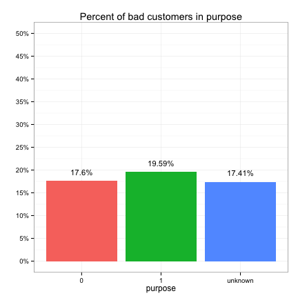
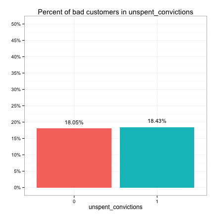
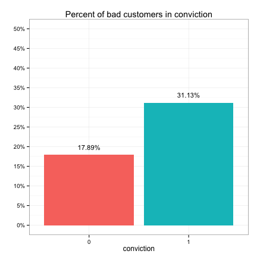
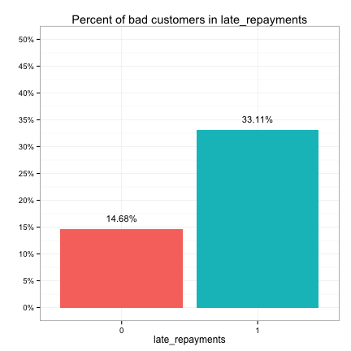
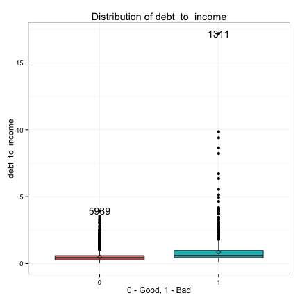
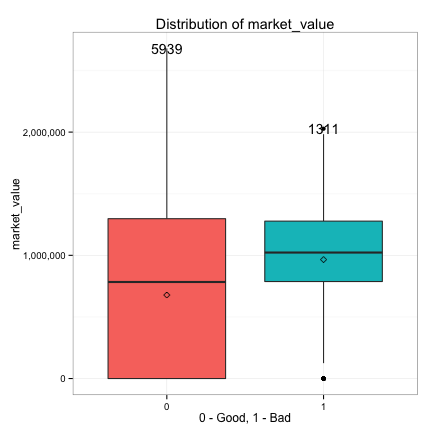
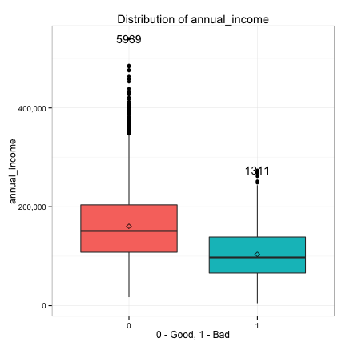
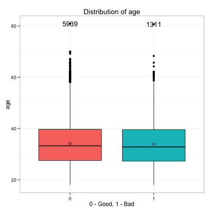

## Descriptive Analysis

First, let's load the cleaned data.

A>
```r
proj_path = "~/score-loan-applicants"
data_path = file.path(proj_path, 'data')
file_path = file.path(data_path, 'cleaned-01.rda')
load(file_path)
```

Next, let's explore the relationships between the categorical predictors and the target.

A>
```r
for (var in iv_cat) {
        tbl = table(upl$bad, upl[[var]])
        pct = tbl["1", ] / (tbl["0", ] + tbl["1", ])
        pct = data.frame(pct)
        pct = cbind(row.names(pct), pct)
        names(pct) = c(var, "percent_bad")
        row.names(pct) = NULL
        # print table
        tbl_pct = pct
        tbl_pct$percent_bad = paste0(round(pct$percent_bad, 4) * 100, "%")
        print(kable(tbl_pct, row.names = FALSE, format = "pandoc", 
                    caption=var))
        cat("\n")
        # print bar plot of percent of bad amongst different predictor levels
        plt = mk_barplot(pct)
        p = plt(var, "percent_bad", fillby=var, xlab=var, legend=F,
                main=paste("Percent of Bad customers \nat each level of", var))
        p = scale_axis(p, "y", use_pct=TRUE, pct_max=0.4, pct_jump=0.05)
        print(p)
        cat("\n")
}
```

```
Table: bankruptcy

bankruptcy   percent_bad 
-----------  ------------
0            17.46%      
1            15.79%      
unknown      33.33%      
```

 

```
Table: purpose

purpose   percent_bad 
--------  ------------
0         17.6%       
1         19.59%      
unknown   17.41%      
```

 

```
Table: exist_customer

exist_customer   percent_bad 
---------------  ------------
0                17.75%      
1                18.74%      
```

 

```
Table: unspent_convictions

unspent_convictions   percent_bad 
--------------------  ------------
0                     18.05%      
1                     18.43%      
```

 

```


Table: conviction

conviction   percent_bad 
-----------  ------------
0            17.89%      
1            31.13%      
```

 

```


Table: repossess

repossess   percent_bad 
----------  ------------
0           18.39%      
1           8.48%       
```

 

```


Table: own_property

own_property   percent_bad 
-------------  ------------
0              4.74%       
1              27.05%      
```

 

```


Table: late_repayments

late_repayments   percent_bad 
----------------  ------------
0                 14.68%      
1                 33.11%      
```

 

```


Table: marital

marital   percent_bad 
--------  ------------
0         19.52%      
1         17.11%      
```

 

```


Table: employment

employment   percent_bad 
-----------  ------------
1            18.34%      
2            16.43%      
3            18.08%      
4            16.77%      
5            15.56%      
6            20.06%      
```

 

These plots suggest that the categorical predictors can be classified into three groups in terms of their potential predictive power:

* Strong: bankruptcy, conviction, repossess, own_property, late_repayments
* Weak: purpose, marital, employment
* None: exist_customer, unspent_convictions

We also examine the relationships between the continuous predictors and the target.


```r
iv_con = c("debt_to_income", "market_value", "credit_line_age", 
           "credit_applications", "annual_income", "age")
# make boxplots
plt = mk_boxplot(upl)
for (var in iv_con) {
        p = plt("bad", var, xlab="0 - Good, 1 - Bad", ylab=var, 
                main = paste("Distribution of", var), legend=F)
        p = scale_axis(p, "y", use_comma=T)
        print(p)
        cat('\r\n\r\n')
}
```

 

 

 

 

 

 


We see the distributions of debt_to_income and annual_income are heavily right skewed, so we take the log transform of debt_to_income and annual_income and replot.


```r
upl = within(upl, {
             log_debt_to_income = log(debt_to_income)
             log_annual_income = log(annual_income) 
             })
plt = mk_boxplot(upl)
for (var in c("log_debt_to_income", "log_annual_income")) {
        p = plt("bad", var, xlab="0 - Good, 1 - Bad", ylab=var, 
                main = paste("Distribution of", var), legend=F)
        print(p)
}
```

  

These plots suggest that the continuous predictors can also be classified into three groups in terms of their potential predictive power:

* Strong: log_debt_to_income, log_annual_income, credit_line_age
* Weak: market_value, credit_applications
* None: age

We also observe that the bulk of zero market values belong to the good customers, while only a few bad customers have zero market values. This suggests owning property (market value > 0) is possibly a strong predictor of a bad customer, which we already discovered when looking at the distribution of own_property just a moment ago. Therefore, it's a good idea to create a categorical version of market_value by binning its values into different intervals based on its distribution.


```r
summary(upl$market_value)
```

```
   Min. 1st Qu.  Median    Mean 3rd Qu.    Max. 
      0       0  856000  730000 1290000 2680000 
```

```r
a = cut(upl$market_value, c(0, 1, 910600, 1290000, 2680000), right=F)
levels(a) = c("$0", "$1 - $910,600", "$910,601 - $1,290,000", 
              "$1,290,001 - $2,680,000")
table(a)
```

```
a
                     $0           $1 - $910,600   $910,601 - $1,290,000 $1,290,001 - $2,680,000 
                   2914                    1043                    1480                    1813 
```

```r
upl$market_value_cat = a
# update iv_cat 
iv_cat = c(iv_cat, "market_value_cat")
```

We then plot the distribution of bad customers in market_value_cat.


```r
# calculate the pct of bad customers 
var = "market_value_cat"
tbl = table(upl$bad, upl[[var]])
pct = tbl["1", ] / (tbl["0", ] + tbl["1", ])
pct = data.frame(pct)
pct = cbind(row.names(pct), pct)
names(pct) = c(var, "percent_bad")
row.names(pct) = NULL
# print table
tbl_pct = pct
tbl_pct$percent_bad = format_as_pct(tbl_pct$percent_bad)
print(kable(tbl_pct, row.names = FALSE, format = "pandoc", caption=var))
```

```


Table: market_value_cat

market_value_cat          percent_bad 
------------------------  ------------
$0                        4.74%       
$1 - $910,600             39.5%       
$910,601 - $1,290,000     30.74%      
$1,290,001 - $2,680,000   16.88%      
```

```r
# draw bar plot
plt = mk_barplot(pct)
p = plt(var, "percent_bad", fillby=var, xlab=var, legend=F, 
        main=paste("Percent of Bad customers \nat each level of", var))
p = scale_axis(p, "y", use_pct=T, pct_max=0.5, pct_jump=0.1)
p = rotate_axis_text(p, 15)
print(p)
```

 

We see that market_value_cat is potentially a strong predictor.

Finally, we collect the predictors into strong, weak and none groups as above discussed so that we can easily access them for future analysis.


```r
# categorical vars
iv_cat_strong = c("bankruptcy", "conviction", "repossess", "own_property", 
                  "late_repayments", "market_value_cat")
iv_cat_weak = c("purpose", "marital", "employment")
iv_cat_none = c("exist_customer", "unspent_convictions")
# continuous vars
iv_con_strong = c("log_debt_to_income", "log_annual_income", "credit_line_age")
iv_con_weak = c("market_value", "credit_applications")
iv_con_none = c("age")
# save
save(upl, iv_cat_strong, iv_cat_weak, iv_cat_none, iv_con_strong,
     iv_con_weak, iv_con_none, file = file.path(data_path, "cleaned-02.rda"))
```
