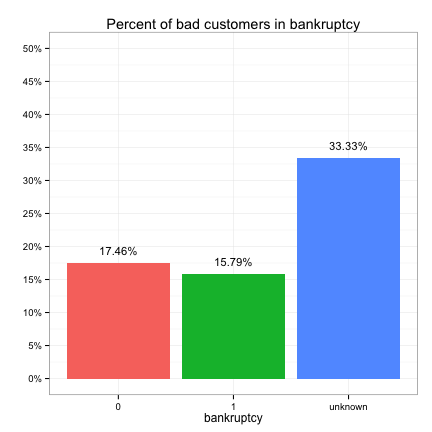
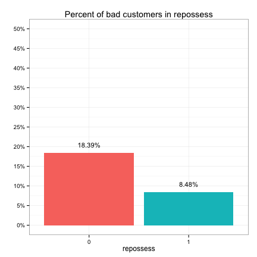
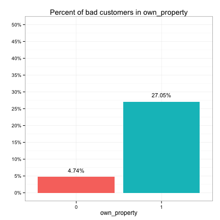
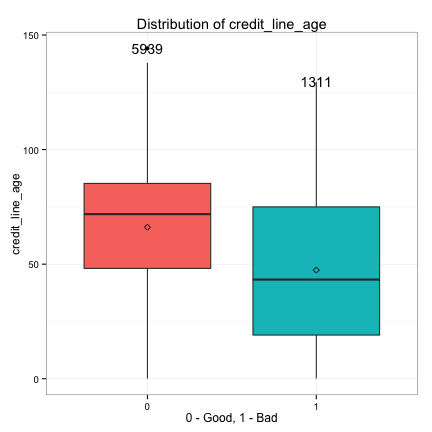
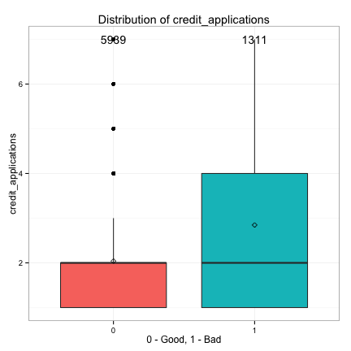
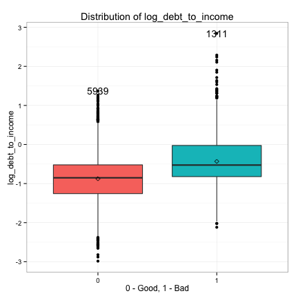
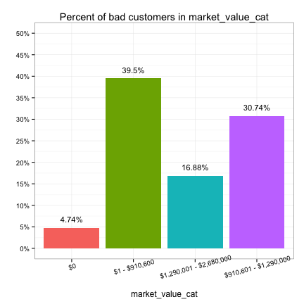

## Descriptive Analysis

First, let's load the cleaned data.


```r
proj_path = "~/score-loan-applicants"
data_path = file.path(proj_path, 'data')
file_path = file.path(data_path, 'cleaned-01.rda')
load(file_path)
```

Next, let's explore the relationships between the categorical predictors and the target. Because the target is binary (bad vs. good), we only need to look at how  bad customers are distributed across the different levels of a given categorical predictor. We first create a helper function that takes a categorical predictor as an input parameter and calculates the percent of bad customers for each of its levels.


```r
calc_pct_bad = function(dat, var) {
        # dat: a data frame
        # yvar, xvar: string, names of variables on dat
        tbl = table(dat$bad, dat[[var]])
        pct = tbl["1", ] / (tbl["0", ] + tbl["1", ])
        pct = data.frame(pct)
        pct = cbind(row.names(pct), pct)
        names(pct) = c(var, "pct_bad")
        row.names(pct) = NULL
        pct
}
# example
calc_pct_bad(upl, iv_cat[1])
```

```
  bankruptcy pct_bad
1          0 0.17461
2          1 0.15789
3    unknown 0.33333
```

Now we can draw bar chart to display these percentages of bad customers.


```r
for (var in iv_cat) {
        tbl = calc_pct_bad(upl, var)
        # append a column of label positions to tbl
        f = add_bar_label_pos(tbl)
        tbl = f(var, "pct_bad", vpos=0.02)
        # draw bar plot
        plt = mk_barplot(tbl)
        p = plt(var, "pct_bad", fillby=var, xlab=var, legend=F,
                main=paste("Percent of bad customers in", var),
                barlab="pct_bad", barlab_at_top=T, barlab_use_pct=T, 
                barlab_size=4)
        p = scale_axis(p, "y", use_pct=TRUE, pct_max=0.5, pct_jump=0.05)
        print(p)
}
```

          

These plots suggest that the categorical predictors can be classified into three groups in terms of their potential predictive power:

* Strong: bankruptcy, conviction, repossess, own_property, late_repayments
* Weak: purpose, marital, employment
* None: exist_customer, unspent_convictions

We also examine the relationships between the continuous predictors and the target.


```r
iv_con = c("debt_to_income", "market_value", "credit_line_age", 
           "credit_applications", "annual_income", "age")
# make boxplots
plt = mk_boxplot(upl)
for (var in iv_con) {
        p = plt("bad", var, xlab="0 - Good, 1 - Bad", ylab=var, 
                main = paste("Distribution of", var), legend=F)
        p = scale_axis(p, "y", use_comma=T)
        print(p)
#         cat('\r\n\r\n')
}
```

      

We see the distributions of debt_to_income and annual_income are heavily right skewed, so we take the log transform of debt_to_income and annual_income and replot.


```r
upl = within(upl, {
             log_debt_to_income = log(debt_to_income)
             log_annual_income = log(annual_income) 
             })
plt = mk_boxplot(upl)
for (var in c("log_debt_to_income", "log_annual_income")) {
        p = plt("bad", var, xlab="0 - Good, 1 - Bad", ylab=var, 
                main = paste("Distribution of", var), legend=F)
        print(p)
}
```

  

These plots suggest that the continuous predictors can also be classified into three groups in terms of their potential predictive power:

* Strong: log_debt_to_income, log_annual_income, credit_line_age
* Weak: market_value, credit_applications
* None: age

We also observe that the bulk of zero market values belong to the good customers, while only a few bad customers have zero market values. This suggests owning property (market value > 0) is possibly a strong predictor of a bad customer, which we already discovered when looking at the distribution of own_property just a moment ago. Therefore, it's a good idea to create a categorical version of market_value by binning its values into different intervals based on its distribution.


```r
summary(upl$market_value)
```

```
   Min. 1st Qu.  Median    Mean 3rd Qu.    Max. 
      0       0  856000  730000 1290000 2680000 
```

```r
a = cut(upl$market_value, c(0, 1, 910600, 1290000, 2680000), right=F)
levels(a) = c("$0", "$1 - $910,600", "$910,601 - $1,290,000", 
              "$1,290,001 - $2,680,000")
table(a)
```

```
a
                     $0           $1 - $910,600   $910,601 - $1,290,000 $1,290,001 - $2,680,000 
                   2914                    1043                    1480                    1813 
```

```r
upl$market_value_cat = a
# update iv_cat 
iv_cat = c(iv_cat, "market_value_cat")
```

We then plot the distribution of bad customers in market_value_cat.


```r
# calculate the pct of bad customers 
var = "market_value_cat"
tbl = calc_pct_bad(upl, var)
# append a column of label positions to tbl
f = add_bar_label_pos(tbl)
tbl = f(var, "pct_bad", vpos=0.02)
# draw bar plot
plt = mk_barplot(tbl)
p = plt(var, "pct_bad", fillby=var, xlab=var, legend=F,
        main=paste("Percent of bad customers in", var), barlab="pct_bad",
        barlab_at_top=T, barlab_use_pct=T, barlab_size=4)
p = scale_axis(p, "y", use_pct=TRUE, pct_max=0.5, pct_jump=0.05)
p = rotate_axis_text(p, 15)
print(p)
```

 

We see that market_value_cat is potentially a strong predictor.

Finally, we collect the predictors into strong, weak and none groups as above discussed so that we can easily access them for future analysis.


```r
# categorical vars
iv_cat_strong = c("bankruptcy", "conviction", "repossess", "own_property", 
                  "late_repayments", "market_value_cat")
iv_cat_weak = c("purpose", "marital", "employment")
iv_cat_none = c("exist_customer", "unspent_convictions")
# continuous vars
iv_con_strong = c("log_debt_to_income", "log_annual_income", "credit_line_age")
iv_con_weak = c("market_value", "credit_applications")
iv_con_none = c("age")
# save
save(upl, iv_cat_strong, iv_cat_weak, iv_cat_none, iv_con_strong,
     iv_con_weak, iv_con_none, file = file.path(data_path, "cleaned-02.rda"))
```
