```r
library(knitr)
opts_chunk$set(comment = "", warning = FALSE, message = FALSE, tidy = FALSE,
               echo = TRUE, fig.width = 6, fig.height = 6, dev = 'png')
options(width = 100, scipen = 5, digits = 5)
```

## Correlations Amongst Predictors

In the last section, we pre-selected predictors that will go into the final modeling building process. In this section, we want to look at their correlations. The purpose is to keep one of the highly correlated predictors while dropping the others. This will reduce or prevent [multicollinearity](http://en.wikipedia.org/wiki/Multicollinearity) in the final model. Let's get started. First, we load data saved from the last section.
        

```r
proj_path = "~/score-loan-applicants"
data_path = file.path(proj_path, 'data')
load(file.path(data_path, 'cleaned-05.rda'))
```

It's easy to obtain the correlations amongst the continuous variables.

```r
cor(upl[, iv_con])
```

```
                    market_value credit_applications log_debt_to_income log_annual_income
market_value             1.00000            -0.18971           -0.30818           0.37805
credit_applications     -0.18971             1.00000            0.62245          -0.58064
log_debt_to_income      -0.30818             0.62245            1.00000          -0.80058
log_annual_income        0.37805            -0.58064           -0.80058           1.00000
credit_line_age          0.24162            -0.65875           -0.73884           0.66661
                    credit_line_age
market_value                0.24162
credit_applications        -0.65875
log_debt_to_income         -0.73884
log_annual_income           0.66661
credit_line_age             1.00000
```

The correlation matrix shows the following pairs of predictors are highly correlated:

* log_debt_to_income, credit_line_age (-0.74)
* log_debt_to_income, log_annual_income (-0.8)

We'll keep log_annual_income and drop log_debt_to_income because the latter has a lower Information Value (0.232 vs. 0.467 for log_annual_income).


```r
iv_con = iv_con[iv_con != "log_debt_to_income"]
```

For the categorical predictors, first of all, we know market_value_cat and own_property are related by definition. Specifically, If market_value_cat is > zero, own_property must be 1 and if own_property = 0, market_value_cat must be zero. We'll keep market_value_cat and drop own_property because market_value_cat contains richer information than own_property. 


```r
iv_cat = iv_cat[iv_cat != "own_property"]
```

For the other categorical predictors, we use bar charts to check if any pair is correlated.


```r
iv_cat_reorder = c(iv_cat[2:5], iv_cat[c(1,6)])
mat = combn(iv_cat_reorder, 2)
for (j in 1:ncol(mat)) {
        pair = mat[1:2, j]
        var1 = pair[1]
        var2 = pair[2]
        tbl = table(upl[[var1]], upl[[var2]])
        pct = tbl["1", ] / apply(tbl, 2, sum)
        pct = data.frame(pct)
        pct = cbind(row.names(pct), pct)
        names(pct) = c(var2, "pct1")
        row.names(pct) = NULL
        # append a column of label positions to pct
        f = add_bar_label_pos(pct)
        pct = f(var2, "pct1", vpos=0.05)
        # make barplots
        plt = mk_barplot(pct)
        p = plt(var2, "pct1", fillby=var2, xlab=var2, legend=F,
                main = paste0("Percent of ", var1, " = 1"),
                ylab=paste(var1, "= 1"), barlab="pct1", barlab_at_top=T,
                barlab_use_pct=T, barlab_size=4)
        p = scale_axis(p, "y", use_pct=T, pct_jump=0.2)
        print(p)
}
```

  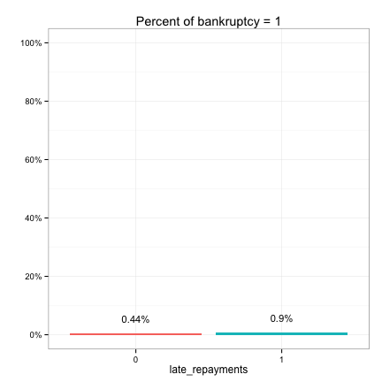 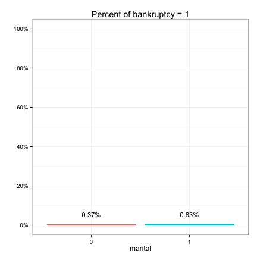  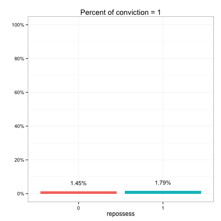  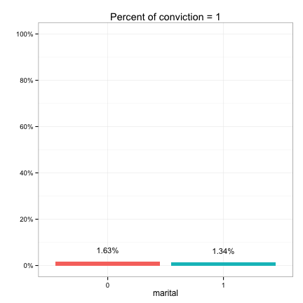 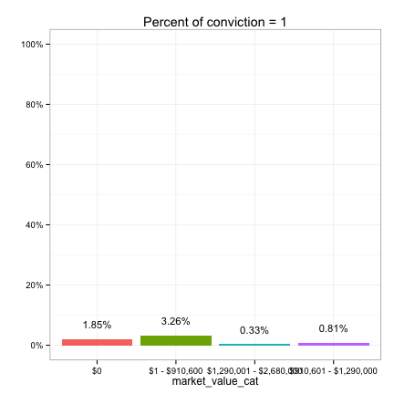 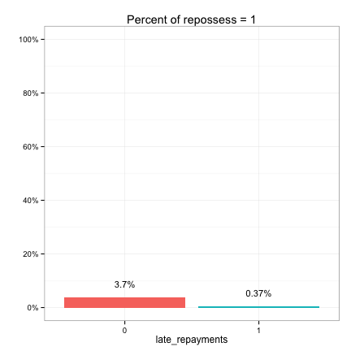 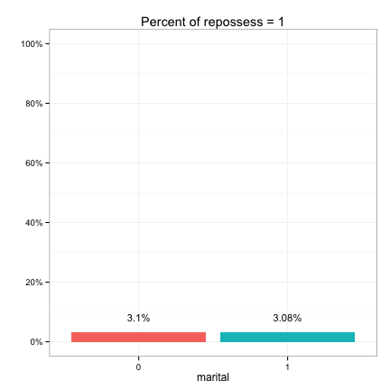  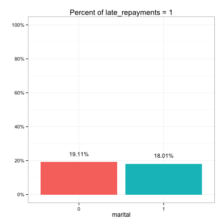   

For non-correlated pairs, the bars should have about the same height. We see that the following pairs are possibly correlated:

* marital, conviction
* marital, late_repayments
* marital, bankruptcy
* conviction, own_property
* conviction, late_repayments
* conviction, bankruptcy
* conviction, market_value_cat
* repossess, own_property
* repossess, late_repayments
* repossess, bankruptcy
* repossess, market_value_cat
* late_repayments, bankruptcy
* late_repayments, market_value_cat
* bankruptcy, market_value_cat

Finally, we use boxplots to examine the correlations amongst categorical and continuous variables.


```r
plt = mk_boxplot(upl)
for (con_var in iv_con) {
        for (cat_var in iv_cat) {
                p = plt(cat_var, con_var, xlab=cat_var, ylab=con_var, legend=F)
                p = rotate_axis_text(p, 5)
                print(p)
        }
}
```

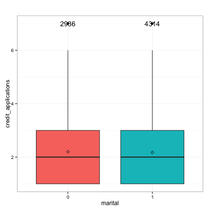 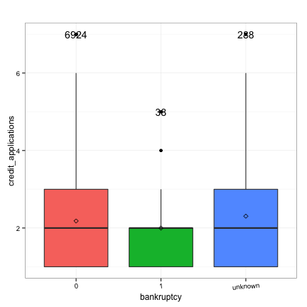 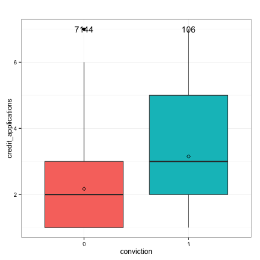 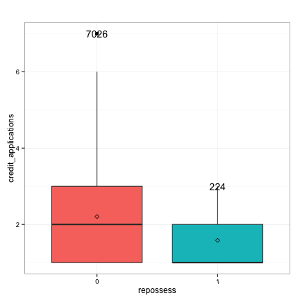 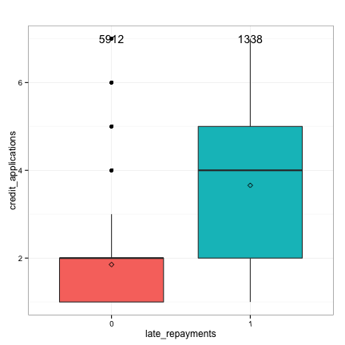 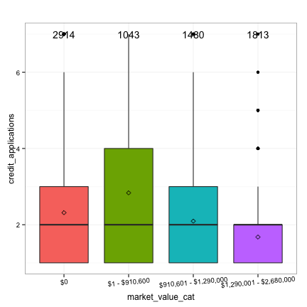 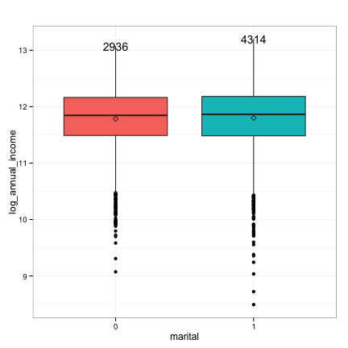 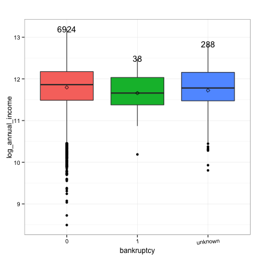 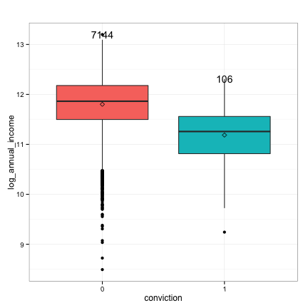 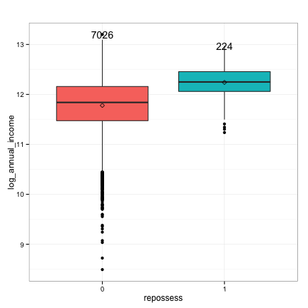 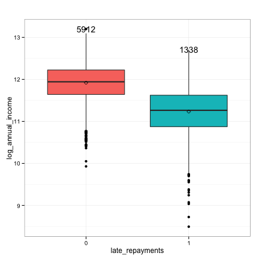 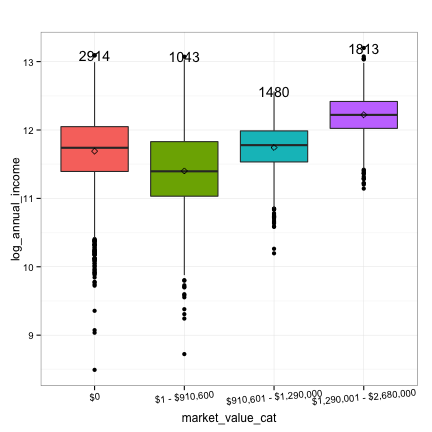 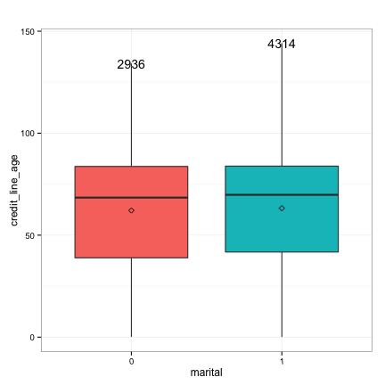 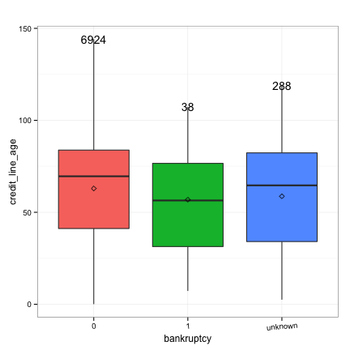 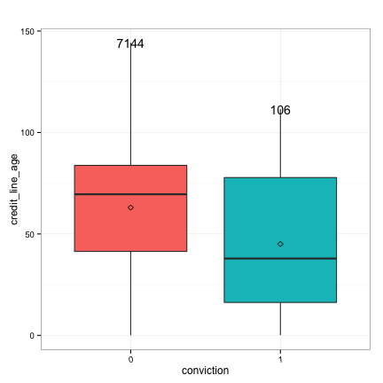  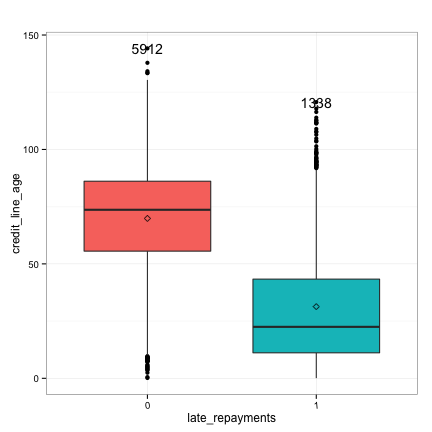 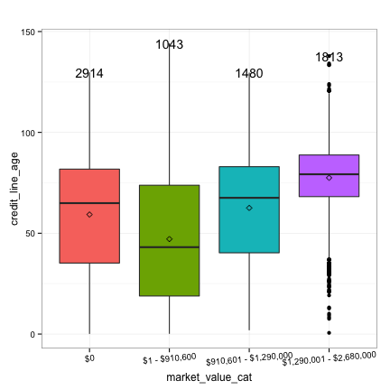       

We see that the following pairs are possibly correlated:

* credit_applications, bankruptcy
* credit_applications, conviction
* credit_applications, repossess
* credit_applications, late_repayments
* credit_line_age, bankruptcy
* credit_line_age, conviction
* credit_line_age, repossess
* credit_line_age, late_repayments
* credit_line_age, market_value_cat
* log_annual_income, bankruptcy
* log_annual_income, conviction
* log_annual_income, repossess
* log_annual_income, late_repayments
* log_annual_income, market_value_cat 

We'll refer back to these correlation observations when we make variable selection decisions and build the final model in the next chapter. Let's close this section by saving the data.

```r
predictors = c(iv_con, iv_cat)
save(upl, predictors, file=file.path(data_path, "cleaned-06.rda"))
```
