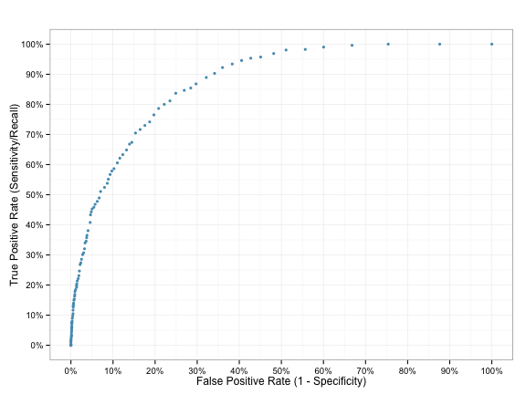
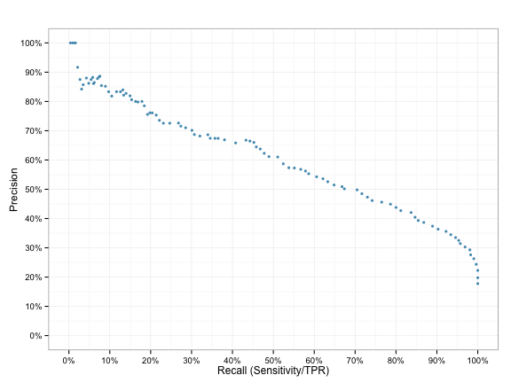
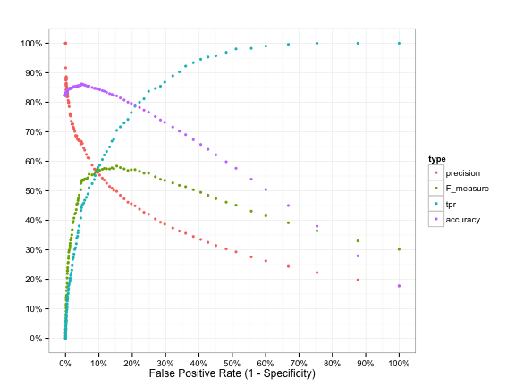

## Performance Curves

In the previous section, we calculated the Accuracy, TPR, FPR, Precision and F-measure on the test set when the threshold probability is 0.5. We can choose the threshold to be any number between 0 and 1, and do the corresponding calculations. Let's vary the threshold from 0 to 1 with an increment of 0.01 and calculate, for each threshold value, the corresponding Accuracy, TPR, FPR, Precision and F-measure on the test data.

A>
```r
prob = predict(bestfit, dat_test, type="response")
cutoffs = seq(0, 1, 0.01)
vec_accuracy = vec_tpr = vec_fpr = vec_precision = vec_F = 
        rep(NA, length(cutoffs))
names(vec_accuracy) = names(vec_tpr) = names(vec_fpr) = names(vec_precision) = 
        names(vec_F) = cutoffs
for (threshold in cutoffs) {
        pred = ifelse(prob > threshold, 1, 0)
        tbl = mk_tbl(pred, dat_test$bad)
        vec_accuracy[as.character(threshold)] = calc_accuracy(tbl)
        vec_tpr[as.character(threshold)] = calc_tpr(tbl)
        vec_fpr[as.character(threshold)] = calc_fpr(tbl)
        vec_precision[as.character(threshold)] = calc_precision(tbl)
        vec_F[as.character(threshold)] = calc_F(tbl)
}
```

### The ROC Curve

If we plot the values of TPR (also called Sensitivity or Recall) against the values of FPR (also called 1 - Specificity), we get something called the ROC curve. The closer the ROC curve is to the uper left corner, the better. This is because we like to have high TPR and low FPR. Quantitatively, this info is captured by the Area Under the Curve (AUC), and the higher the AUC, the better. We now plot the ROC curve and calculate the AUC.

A>
```r
library(ezplot)
dat_roc = data.frame(fpr=vec_fpr, tpr=vec_tpr)
# plot the ROC curve
plt = mk_scatterplot(dat_roc)
p = plt("fpr", "tpr", xlab="False Positive Rate (1 - Specificity)", 
        ylab="True Positive Rate (Sensitivity/Recall)",
        pt_size=1.5, pt_alpha=1)
p = scale_axis(p, "x", use_pct=T, pct_jump=0.1)
p = scale_axis(p, "y", use_pct=T, pct_jump=0.1)
print(p)
```

 

A>
```r
calc_auc = function(fpr, tpr) {
        # calculates the AUC
        # fpr, tpr: numeric vectors
        names(fpr) = names(tpr) = NULL
        auc = 0
        for (i in 2:length(fpr)) # adds up the areas of the trapezoids 
                auc = auc + 0.5 * (tpr[i] + tpr[i - 1]) * abs(fpr[i] - fpr[i - 1])
        auc
}
calc_auc(vec_fpr, vec_tpr)
```

A>{linenos=off}
```
[1] 0.87496
```

An AUC of 0.875 is pretty high, and this gives us good confidence in our logit model `bestfit`.

### The Precision-Recall Plot

We can also plot the Precisions vs. the Recalls.

A>
```r
dat_prec_recall = data.frame(precision=vec_precision, recall=vec_tpr)
# plot Precision vs. Recall
plt = mk_scatterplot(dat_prec_recall)
p = plt("recall", "precision", xlab="Recall (Sensitivity/TPR)", 
        ylab="Precision", pt_size=1.5, pt_alpha=1)
p = scale_axis(p, "x", use_pct=T, pct_jump=0.1)
p = scale_axis(p, "y", use_pct=T, pct_jump=0.1)
print(p)
```

 

### The Comprehensive Plot

Finally, we can plot the Precision, F-measure, Recall and Accuracy vs. FPR all in one plot. Note that Recall vs. FPR is just the ROC curve.

A>
```r
library(dplyr)
library(tidyr)
# gather data into data frame for plotting
dat_plt = data.frame(fpr=vec_fpr, precision=vec_precision, F_measure=vec_F,
                     tpr=vec_tpr, accuracy=vec_accuracy)
dat_plt = dat_plt %>% gather(type, val, -fpr)
# plot Precision, F-measure, TPR and accuracy vs. FPR
plt = mk_scatterplot(dat_plt)
p = plt("fpr", "val", fillby="type", pt_size=1.5, pt_alpha=1, ylab="", 
        xlab="False Positive Rate (1 - Specificity)") 
p = scale_axis(p, "x", use_pct=T, pct_jump=0.1)
p = scale_axis(p, "y", use_pct=T, pct_jump=0.1)
print(p)
```

 

Because a bad customer is really costly, we want to identify as many bad customers as possible. To do that, we need to increase the TPR. At the 0.5 probability threshold, we have a TPR of 35.73% and a FPR of 3.73%. The above plot shows that we can increase the TPR to ~80% by increasing the FPR to ~20% (the blue curve). At the same time, the accuracy won't decrease much and will be still around 80% (the purple curve). In general, we can make this procedure precise by maximizing the TPR over a grid of threshold values. We do that in the next section.
